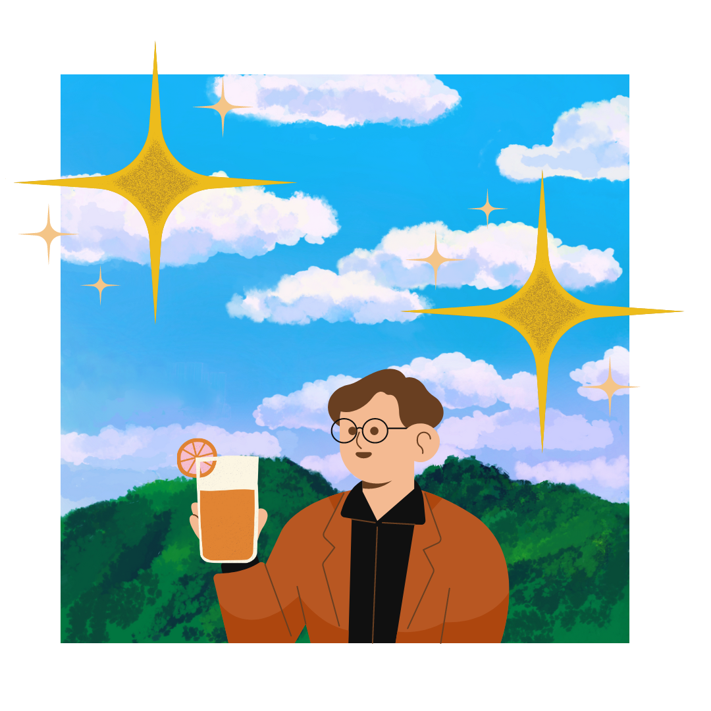

## Sobre mim

💖 Meu nome é Mariana Schlickmann, tenho 30 anos, sou natural de Santa Catarina.

🏳️‍🌈 Faço parte da comunidade LGBTQIA+ e estou em um relacionamento sério com uma mulher, pesquisadora, mestre, incrível e extraordinária. Temos uma cachorrinha chamada Matilda, e uma gatinha espoleta chamada Capitu. Minha forma de aproveitar o tempo livre é assistindo séries, praticando esportes, indo ao cinema, realizando alguns trabalhos manuais em casa, com marcenaria ou pintura, passando o dia com amigos ou família, sempre com jogos de tabuleiro ou digitais, tenho o famoso dedo verde, amo plantas e botânica, o que considero minha verdadeira vocação. Estou sempre em busca de conhecimento e coisas novas para provar e me divertir, sou ótima cozinhando, já atuei em algumas cozinhas profissionais, atualmente estou me arriscando na arte do bordado.

👩‍💻  Sou uma entusiasta de tecnologia, apaixonada por Desenvolvimento e Cibersegurança.

🌱  Há três anos, iniciei minha transição de carreira para a área de tecnologia. Atualmente, estou cursando Análise e Desenvolvimento de Sistemas, mas minha jornada com programação e desenvolvimento começou ainda na faculdade de Engenharia Agronômica, minha primeira formação. Durante minha atuação em laboratórios de pesquisa científica, a análise de dados se tornou uma habilidade indispensável. Foi nesse contexto que aprendi a utilizar Python e suas bibliotecas, além de explorar o uso de R, ferramentas fundamentais para lidar com grandes volumes de informações e obter insights valiosos.

🖥️ No segundo semestre do meu curso de ADS, conquistei um estágio na Logicalis, uma empresa global que oferece soluções e serviços de TI e comunicação, com operações na Europa, América do Norte, América do Sul e Ásia-Pacífico. Durante essa oportunidade pude me aprofundar na área de Redes e Cibersegurança, onde obtive algumas certificações, como: FCA, FCF, CCST Networking e CCST Cybersecurity.
 
💼 A área de tecnologia que mais me entusiasma, e na qual tenho me dedicado intensamente, é Desenvolvimento Full Stack, utilizando tecnologias como CSS, JavaScript, Java, Angular, onde trabalho ativamente em projetos pessoais para continuar praticando e aprimorando minhas habilidades. Meu principal objetivo é lapidar minhas competências para conquistar MEU PRIMEIRO EMPREGO DOS SONHOS.

🚀 Esta sou eu – aspiro evoluir, compartilhar conquistas e espalhar conhecimento.

 

## Linguagens e Ferramentas

### Linguagens e Ferramentas de Programação

### Bibliotecas e Frameworks

### Ferramentas de Desenvolvimento

### Certificações em Redes e Cibersegurança

 
 
 
 

 

## Estatísticas do Github

## Contato  

- [LinkedIn](https://linkedin.com/in/marianaschlickmann) | [E-mail](mailto:mariana.silva@email.com) | [Instagram](https://instagram.com/mariana.schlick)

## Extras

🎨 As artes disponíveis neste README foram criadas por mim com o auxílio da ferramenta .
